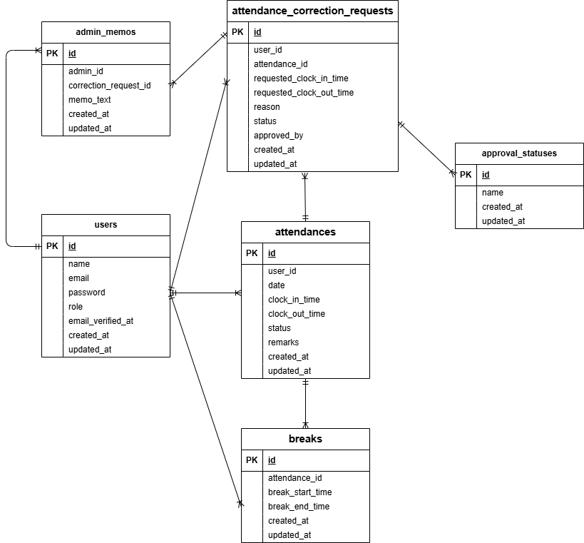

# AttendanceApp

## 環境構築

### Docker ビルド

1. git clone <https://github.com/hisashi-mamada/AttendanceApp.git>
2. cd AttendanceApp
3. docker-compose up -d --build

### Laravel 環境構築

1. `docker-compose exec php bash` でコンテナの PHP に入る
2. `composer install` で必要なパッケージをインストール
3. `.env.example`  を  `.env`  にコピーし、環境変数を設定
4. `php artisan key:generate` でアプリケーションキーを作成
5. `php artisan migrate` で本番用DBにマイグレーション
6. `php artisan db:seed` で本番用DBにデータ投入

### テスト環境構築

1. `.env`  をコピーして  `.env.testing`  を作成（phpunit 用テスト環境の設定）
2. `php artisan migrate --env=testing` でテスト用DBにマイグレーション
3. `php artisan db:seed --env=testing` でテスト用DBにデータ投入
4. `php artisan test`でテスト実行

### 開発補助コマンド

1. `php artisan make:test` テストファイル作成
2. `php artisan route:list` ルーティング一覧を表示
3. `php artisan serve`     アプリ起動

### 権限エラーが出た場合

ログやキャッシュ関連でエラーが出た場合は、以下を実行してください

chmod -R 777 storage
chmod -R 777 bootstrap/cache

## 使用技術（実行環境）

- PHP 8.1
- Laravel 10.10
- mysql:8.0.26
- Docker / Docker Compose
- Mailhog（メールテスト）
- phpMyAdmin（DB可視化）

## ER 図

## URL

- 開発環境: [http://localhost](http://localhost)
- phpMyAdmin: [http://localhost:8080](http://localhost:8080)
- Mailhog: <http://localhost:8025>

## ユーザーについて

- 管理者ユーザー
-'email' => ['admin@example.com',]
-'password' =>['password123']

- 一般ユーザー
-'name' => '山田 花子',
-'email' => ['user4@example.com',]
-'password' =>['password01']
